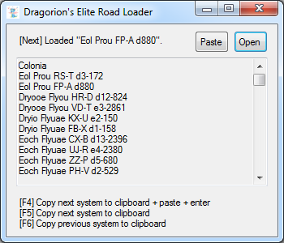

# EliteRoadLoader
Simple C# tool to load system names from files or user input, then traverse via single key presses. Also automates copy and paste (need to have mouse cursor above system map text field when using paste).

Usable for example with files downloaded from https://www.spansh.co.uk/exact-plotter.

Created by Visual Studio 2012, meant to be used as a third-party tool with the video game 'Elite Dangerous'.

